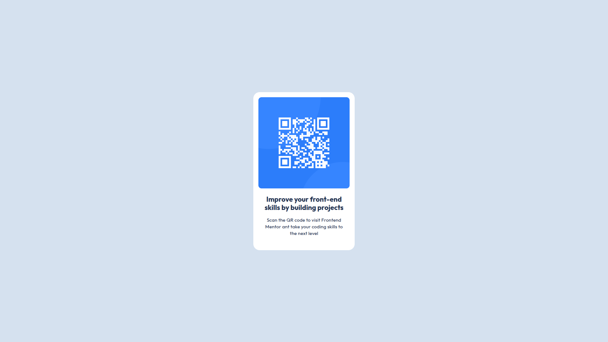

# Frontend Mentor - QR code component solution

This is a solution to the [QR code component challenge on Frontend Mentor](https://www.frontendmentor.io/challenges/qr-code-component-iux_sIO_H). Frontend Mentor challenges help you improve your coding skills by building realistic projects.

## Table of contents

- [Frontend Mentor - QR code component solution](#frontend-mentor---qr-code-component-solution)
  - [Table of contents](#table-of-contents)
  - [Overview](#overview)
    - [Screenshot](#screenshot)
    - [Links](#links)
  - [My process](#my-process)
    - [Built with](#built-with)
    - [What I learned](#what-i-learned)
    - [Continued development](#continued-development)
    - [Useful resources](#useful-resources)
  - [Author](#author)

**Note: Delete this note and update the table of contents based on what sections you keep.**

## Overview

### Screenshot

### Links

- Solution URL: [Code](https://github.com/jordhanlucaso/qr-component)
- Live Site URL: [Add live site URL here](https://your-live-site-url.com)

## My process

### Built with

- Semantic HTML5 markup
- CSS custom properties
- Flexbox

### What I learned

I want to improve my development workflow and my proficiency as a developer.

### Continued development

I will like to improve my design habilities and css to be able to create great looking websites and components.

### Useful resources

- [W3schools](https://www.w3schools.com/tags/) - This helped me for XYZ reason. I really liked this pattern and will use it going forward.this concept.
-

## Author

- Github - [Jordhan](https://github.com/jordhanlucaso)
- Frontend Mentor - [@jordhanlucaso](https://www.frontendmentor.io/profile/jordhanlucaso)
